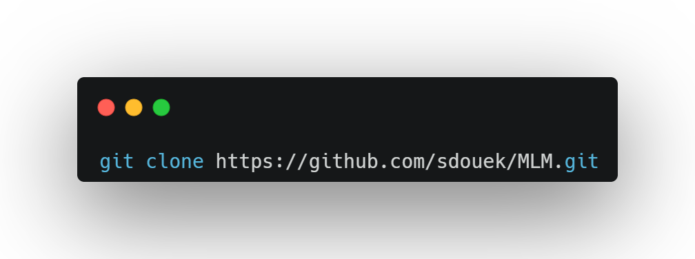
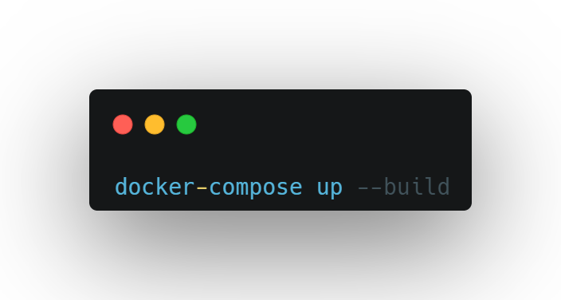
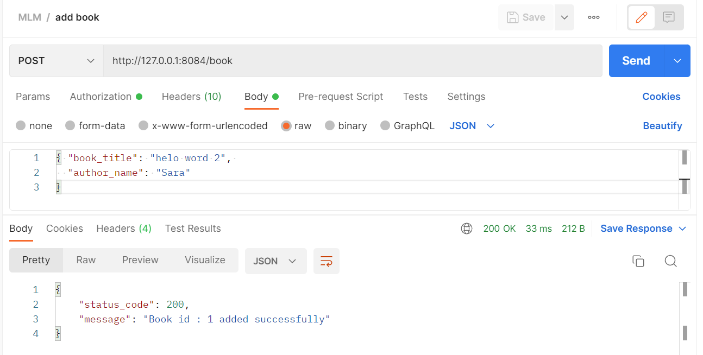
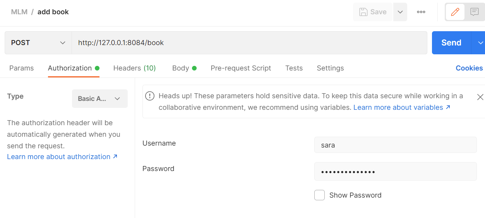
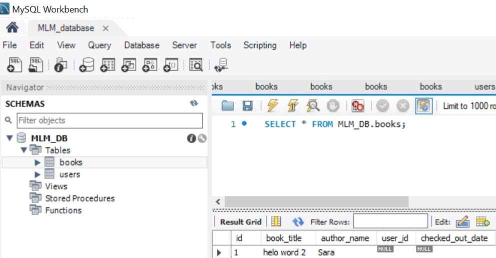

# Mobileye Library Management System

This project is a library management system using MySQL as the database, Docker-compose for containerization, and Script Automatic for automatic DB table creation and management.
The project is implemented using the SQLAlchemym model, which allowing the object model and database schema to develop in a cleanly decoupled way from the beginning.
The system allows users to keep track of books in a library, including adding, editing, and deleting books, as well as checking out and returning books.
# Getting Started
These instructions will get you a copy of the project up and running on your local machine for development and testing purposes.
# Prerequisites
- Docker and Docker Compose must be installed on your machine
- A MySQL server running on the default port (3306)
- MySql Workbench - is advanced , only for debugging
# Installing
1. Clone the repository to your local machine:
**git clone https://github.com/sdouek/MLM.git**

2. Navigate to the project directory and run the following command to start the application:
**dokcer-compose up --build**
 
 This cmd will start the entire system!  MySQL server and the application in separate containers.
3. The application will be accessible at http://127.0.0.1:8084
# Usage
The application provides the following functionality:

- POST /user/register - Register a new user
- POST /book - Add a new book
- DELETE /book/<book_id> - Delete an existing book
- GET /catalog - Retrieves a list of all books in the catalog
- PUT /checkout/book/<book_id> - Checkout an existing book
- PUT /return/book/<book_id> - Return an existing book
- GET /checked_out/book/<user_name> - View checked out books by user

**API Documentation can be found here:** 
https://app.swaggerhub.com/apis-docs/SARIMIMIG/Mobileye-Library-Management/1.1

# Include Tests
- cd MLM/tests
- MLM.postman_collection with all tests api can be import to postman and run 
- Test example:

 Basic Auth is needed: 
 The result is in DB: 

# Built With
- [Docker](https://www.docker.com/) - Containerization platform
- [Docker Compose](https://docs.docker.com/compose/) - Tool for defining and running multi-container applications
- [MySQL](https://www.mysql.com/) - Relational database management system
- [Workbench](https://www.mysql.com/products/workbench/) - Tool for database architects, developers, and DBAs

# Authors
Sara Douek - sdouek
